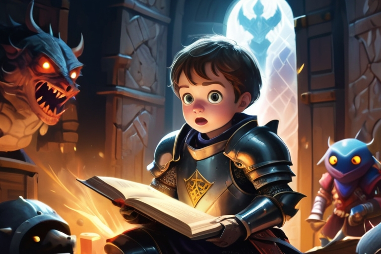

# TextOdyssey 

Welcome to TextOdyssey, a captivating text-based adventure game that takes you on a journey of choices and consequences.

## Overview

TextOdyssey is a Python-based interactive narrative game where your decisions shape the course of your epic adventure. Immerse yourself in a rich storyline, solve challenging puzzles, and explore a world brought to life through the power of words.



## Features

- **Immersive Storytelling:** Experience a captivating narrative that responds to your choices.
  
- **Puzzle Solving:** Encounter challenging puzzles that require wit and creativity to overcome.

- **Decision Points:** Every decision you make influences the outcome of your journey.

## Getting Started

1. **Clone the Repository:**
   ```bash
   git clone https://github.com/your-username/TextOdyssey.git


## Video

https://github.com/AlexandreCorcos/TextOdyssey/assets/62084483/0798eae7-5ba0-4c84-81ec-0e584571aba5

